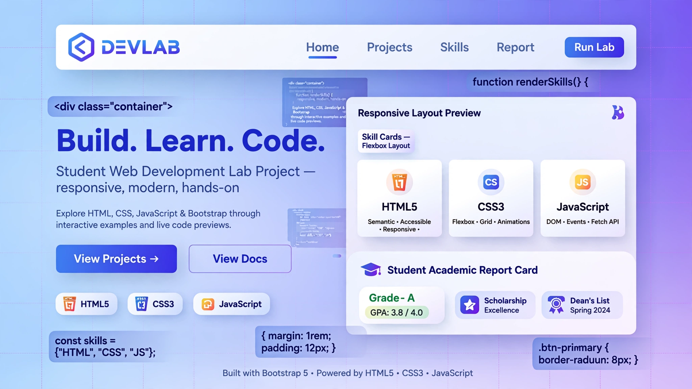

<div align="center">

# Full-Stack Lab 02

[](https://developer.mozilla.org/en-US/docs/Web/HTML)
[](https://developer.mozilla.org/en-US/docs/Web/CSS)
[](https://developer.mozilla.org/en-US/docs/Web/JavaScript)
[](https://getbootstrap.com/)

**A coursework lab combining a responsive multi-section webpage (HTML + CSS + Bootstrap) with a JavaScript academic & scholarship management system that grades a student, checks pass/fail, and decides scholarship eligibility — all rendered live in the browser.**

</div>

---

## 📸 Preview



---

## ✨ What It Covers

**The page** (`index.html` + `style.css`)
- Responsive navbar, hero section with gradient and profile image
- Student profile card, skills section built with CSS Flexbox, and project cards using filters and pseudo-elements
- Bootstrap 5 flex utility demos, relative/absolute CSS positioning demo, contact section, footer

**The JavaScript** (`script.js`)
- Student records as JS objects (name, registration no., program, semester, CGPA, attendance, marks)
- Marks & percentage calculation with arithmetic operators
- Grade assignment (A–F) and pass/fail status with `if / else if / else`
- Scholarship eligibility — Gold / Silver / Bronze tiers using `&&`, `||`, and `!`
- Academic standing warnings (Good Standing / Academic Warning / Critical)
- Styled report card rendered into the page via DOM manipulation (`innerHTML`)
- `var` vs `let` hoisting demonstration (check the browser console)

Try the commented-out student scenarios at the top of `script.js` — high performer, average, low attendance, poor performance — to see the logic react.

---

## 🛠️ Tech Stack

- **HTML5** — semantic page structure
- **CSS3** — Flexbox layouts, positioning, pseudo-elements, filters, gradients
- **Bootstrap 5.3.3** (CDN) — navbar, badges, cards, flex utilities
- **Vanilla JavaScript** — objects, operators, conditionals, DOM manipulation

---

## 🚀 Run It

No build step — it's plain static files.

```bash
git clone https://github.com/hussnainahmedd/full-stack-lab-02.git
cd full-stack-lab-02
```

Then open `index.html` in any browser, and open the developer console to see the hoisting demo.

---

## 📁 Project Structure

```
├── index.html   # Page structure: navbar, hero, profile, skills, projects, contact
├── style.css    # Custom CSS: flexbox, positioning, gradients, effects
└── script.js    # Academic & scholarship logic + DOM rendering + hoisting demo
```

---

Built by [Hussnain Ahmad](https://github.com/hussnainahmedd) — a Full-Stack Web Development lab exercise.
